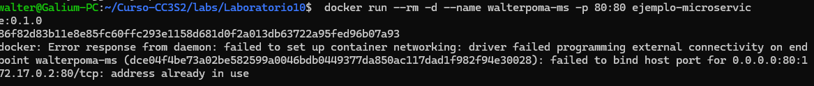
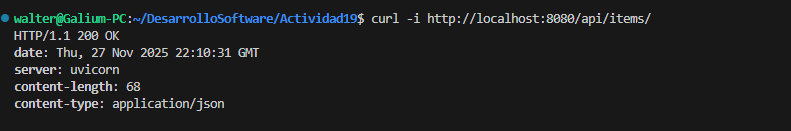
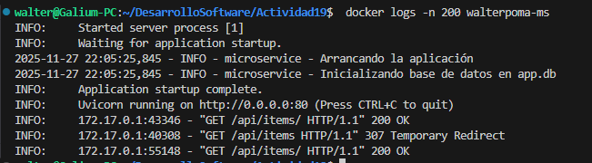
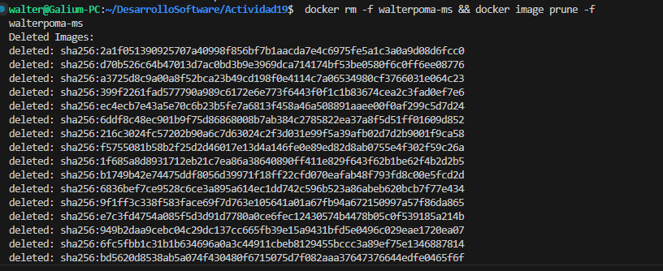
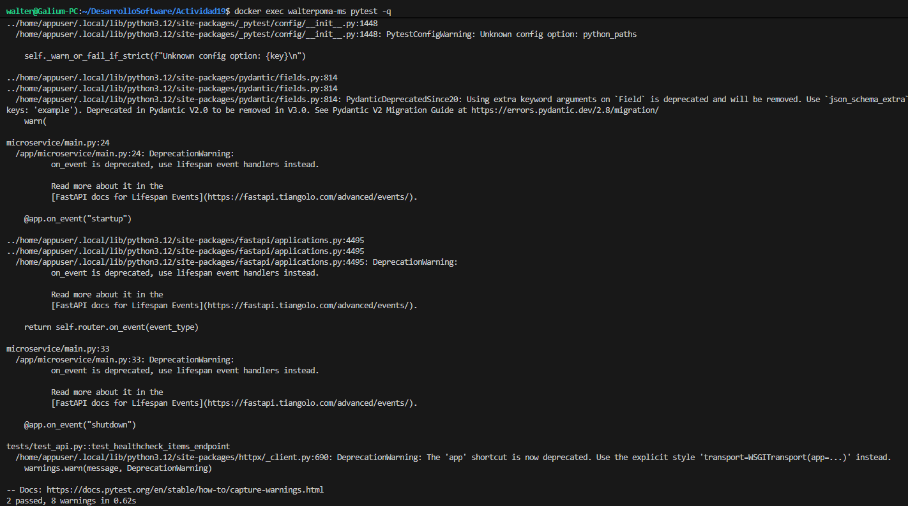

# Responsable : Walter Bryan Poma Navarro

Repositorio: [https://github.com/bgalium/Actividad19-CC3S2.git](https://github.com/bgalium/Actividad19-CC3S2.git)

---
# Bloque 1
1. Conceptualización de Microservicios

La industria ha migrado desde aplicaciones tipo monolita que es todo en un solo proceso, luego por SOA( Arquitectura Orientada a Servicios) que es generalmente mas pesada y centrada en buses de servicio, hasta llegar a los microservicios, que son ligeros e independientes con smarts points.

Casos donde el Monolito falla:
* E-commerce con pico estacionales, el monolito se vuelve costoso operar por que debe escalar toda la aplicación anuque solo sean los módulos de pago que tengan alta demanda.

* SaaS Multi-tenant: en este caso si un cliente corporativo satura el sistema con reportes grandes bloquea el rendimiento para clientes pequeños.

Popularidad y beneficios:

Empresas grandes adoptaron los microservicios para lograr aislamiento de fallos y escalado granular.¨Por ejemplo un servicio de streaming así se caiga su catalogo  o Pagos sigue brindando el servicio de reproducción eso es el aislamiento de fallos y el escalado granular es que solo se replican contendeores que sufren carga.

Desventajas y retos:
* Reto: Redes y Orquestación. Miotigación: Trazabilidad  (Jaeger)

* Reto: Consistencia de datos distribuida. Mitigación: Patrón Sagas o consistencia eventual.

* Reto: Testing Distribuido. Mitigación: Implementar Pruebas Contractuales (Contract Testing).

# Bloque 2

Paso 1: Construcción (Evidencia 01_build.txt)

Paso 2: Ejecución (Evidencia 02_run.txt)

Paso 3: Verificación (Evidencia 03_health.txt)

Paso 4: Logs

Paso 5: Limpieza

Test Automatizados

Por que no se usa Latest?

Porque es una etiqueta mutable y antigua. Si se despliega latest hoy y mañana se actualiza la imagen base con un bug, el despliegue se rimpe sin cambiar nuestro código.

SemVer garantiza: 
* Reproducibilidad: reconstruir exactamente la misma imagen.
* Trazabilidad: saber qué cambios introdujo cada versión.
* Despliegues seguros: promover versiones probadas (por ejemplo de 0.1.0 a 0.1.1 sin sorpresas).

